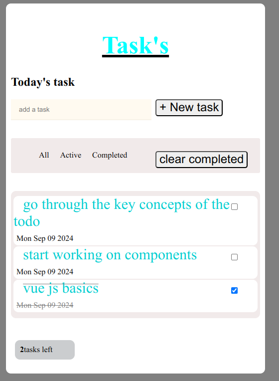

# practice

This is a simple todo app implementation using vue js 3..

# UI screenshot

# API
composition API

# key features
1.list rendering using v-for and :key directive
2.conditional rendering using v-if and v-else
3.computed property and methods
4.data binding using v-bind and v-model
5.event handling using v-on that is @
6.state management using onHashChange function

